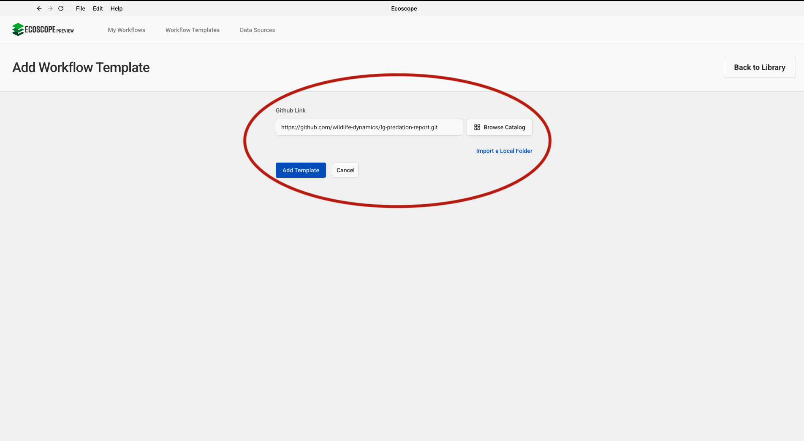
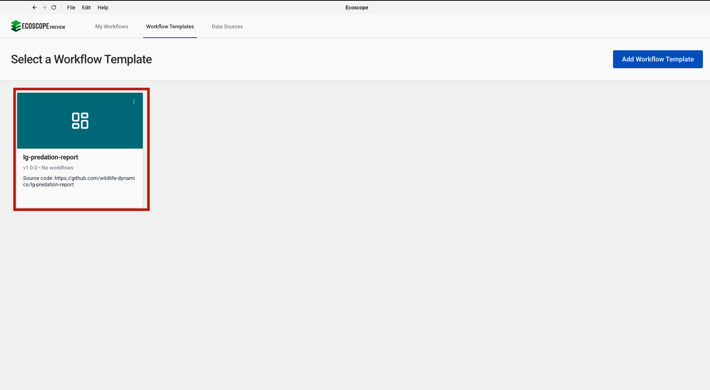
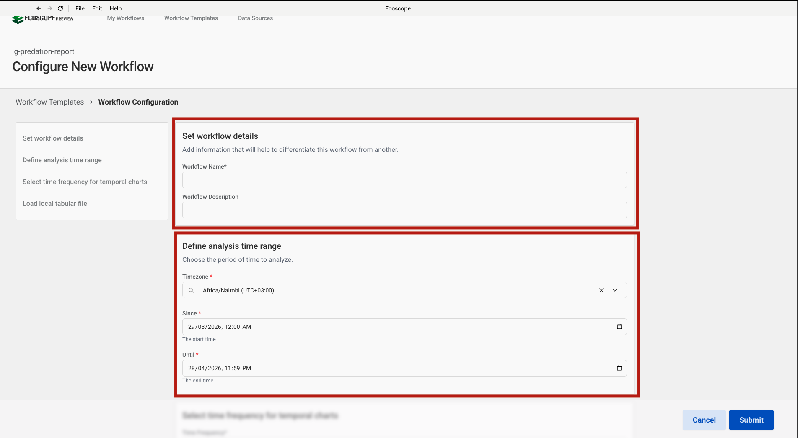
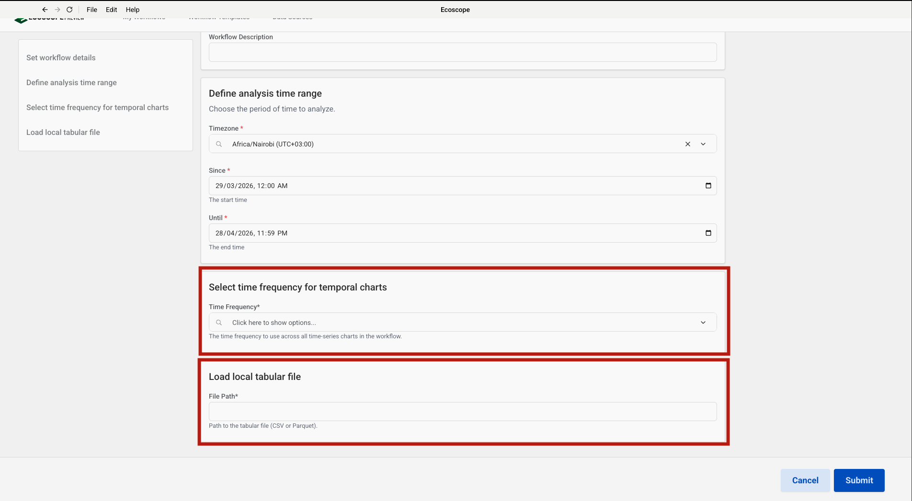

# LG Predation Report Workflow — User Guide

This guide walks you through configuring and running the LG Predation Report Workflow, which generates a livestock depredation analysis report for Lion Guardians field teams in the Amboseli ecosystem using a locally uploaded predation data file.

---

## Overview

The workflow produces, for each group:

- A **Livestock Predation Event map** (scatter plot of incidents coloured by species)
- A **Predation Density Grid map** (2 000 m grid showing spatial concentration of attacks)
- **Pie charts** — total livestock killed by species and by ranch
- **Heatmaps** — livestock killed by species × ranch, and by species × time
- **Multi-bar time series charts** — kills over time by ranch and by species
- **Multi-line time series charts** — kills over time by ranch and by species
- **Summary CSV tables** — crosstab (species × ranch), location of attack, herder effectiveness, species-ranch matrix
- A **Word document report** (`.docx`) with a cover page and combined report section
- An **interactive widget dashboard**

---

## Prerequisites

Before running the workflow, ensure you have:

- A **predation data CSV file** exported from the Lion Guardians predation form, using `latin-1` encoding
- GPS coordinates recorded as UTM Easting and Northing in **UTM Zone 37S** (`GPS X (UTM)` and `GPS Y (UTM)` columns)

> The three spatial boundary files (group ranch boundaries, conflict hotspot areas, and protected areas) are downloaded automatically from Dropbox — no local copies are required.

---

## Step-by-Step Configuration

### Step 1 — Add the Workflow Template

In the workflow runner, go to **Workflow Templates** and click **Add Workflow Template**. Paste the GitHub repository URL into the **Github Link** field:

```
https://github.com/wildlife-dynamics/lg-predation-report.git
```

Then click **Add Template**.



---

### Step 2 — Select the Workflow

After the template is added, it appears in the **Workflow Templates** list as **lg-predation-report**. Click it to open the workflow configuration form.

> The card may show **Initializing…** briefly while the environment is set up.



---

### Step 3 — Configure Workflow Details and Time Range

The configuration form opens with two sections at the top.

**Set Workflow Details**

| Field | Description |
|-------|-------------|
| Workflow Name | A short name to identify this run |
| Workflow Description | Optional notes about the run (e.g. date range or reporting period) |

**Time Range**

| Field | Description |
|-------|-------------|
| Timezone | Select the local timezone (e.g. `Africa/Nairobi UTC+03:00`) |
| Since | Start date and time of the analysis period |
| Until | End date and time of the analysis period |

All maps, charts, and summary tables are computed for incidents within this window.



---

### Step 4 — Configure Groupers, Time Frequency, and Upload Data File

Scroll down to configure three sections.

**Set Groupers** *(optional)*

Groupers control how the workflow partitions data for per-group outputs. If left blank, all data appears in a single combined view. Click **Add** to add a grouper. Available options:

| Grouper | Effect |
|---------|--------|
| Livestock Species | One map, charts, and tables per livestock species killed |
| Ranch | One output per group ranch |

**Select Time Frequency for Temporal Charts**

Choose the time bucket used to aggregate kills on the x-axis of the time series charts and the species-by-time heatmap:

| Option | Effect |
|--------|--------|
| Daily | One bar / point per day |
| Weekly | One bar / point per week |
| Monthly | One bar / point per month |
| Yearly | One bar / point per year |

**Upload Local Predation File**

Click **Choose File** and select the predation CSV exported from the Lion Guardians data system. The file must be in `latin-1` encoding and contain the standard predation form columns including `GPS X (UTM)` and `GPS Y (UTM)`.

> The file is processed locally — no data is sent to EarthRanger.



---

## Running the Workflow

Once all parameters are configured, click **Submit**. The runner will:

1. Load and clean the uploaded predation CSV, normalising species names, ranch labels, and location fields.
2. Convert UTM coordinates (Zone 37S) to WGS 84 and filter the data to livestock incidents only.
3. Download the static boundary files (group ranch boundaries, conflict hotspot areas, protected areas).
4. Generate the Livestock Predation Event map and the Predation Density Grid map.
5. Compute the four summary CSV tables (crosstab, location of attack, herder effectiveness, species-ranch matrix).
6. Render the two pie charts, two heatmaps, two multi-bar charts, and two multi-line charts.
7. Assemble the Word report (cover page + combined report section).
8. Save all outputs to the directory specified by `ECOSCOPE_WORKFLOWS_RESULTS`.

---

## Output Files

All outputs are written to `$ECOSCOPE_WORKFLOWS_RESULTS/`:

| File | Description |
|------|-------------|
| `<group>_livestock_predation_map.html` | Interactive livestock predation event map per group |
| `<group>_density_grid_map.html` | Interactive predation density grid map per group |
| `<group>_livestock_predation_map.png` | Screenshot of the predation event map (2× resolution) |
| `<group>_density_grid_map.png` | Screenshot of the density grid map (2× resolution) |
| `<group>_livestock_killed_pie_chart.png` | Screenshot of the livestock species pie chart (2× resolution) |
| `<group>_livestock_killed_by_ranch_pie_chart.png` | Screenshot of the ranch pie chart (2× resolution) |
| `<group>_species_by_ranch_heatmap.png` | Screenshot of the species × ranch heatmap (2× resolution) |
| `<group>_species_by_time_heatmap.png` | Screenshot of the species × time heatmap (2× resolution) |
| `<group>_livestock_species_killed_ranch_multibar.png` | Screenshot of kills by ranch multi-bar chart (1 280 × 2 000 px) |
| `<group>_livestock_species_killed_multibar.png` | Screenshot of kills by species multi-bar chart (1 280 × 2 000 px) |
| `<group>_livestock_killed_over_time_by_ranch_chart.png` | Screenshot of kills by ranch multi-line chart (2× resolution) |
| `<group>_livestock_killed_over_time_by_species_chart.png` | Screenshot of kills by species multi-line chart (2× resolution) |
| `<group>_total_livestock_killed_by_ranch.csv` | Species × ranch crosstab of total kills with row and column totals |
| `<group>_location_of_attack.csv` | Boma vs bush attack counts and percentages |
| `<group>_herder_effectiveness.csv` | Livestock loss outcomes relative to herder presence |
| `<group>_species_ranch_matrix.csv` | Livestock species × ranch kill count matrix |
| `context_page.docx` | Rendered report cover page |
| Merged report `.docx` | Final combined Word report (cover page + main section) |
