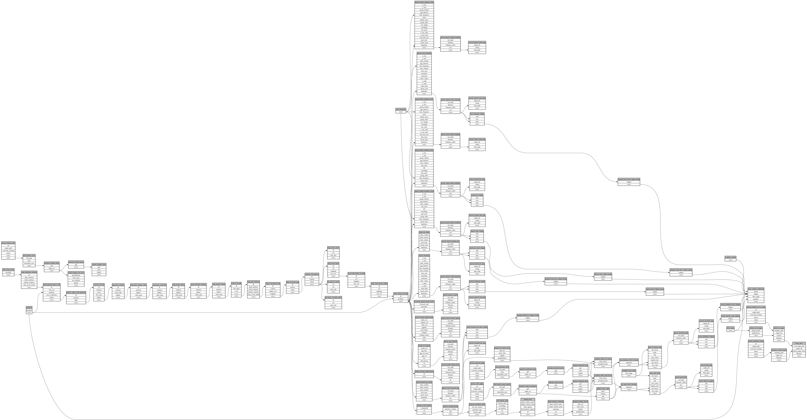

```
# AUTOGENERATED BY ECOSCOPE-WORKFLOWS; see fingerprint in README.md for details

```

```yaml
# fingerprint:
artifacts_sha256_basic: 771e4f6b26f9415f82669090a6e1a6e20eba7faebc5dd66a5b303101c47afcce
artifacts_sha256_strict: d42192cdb0ad1a0c9bc979952403bb646494273811d001b7d814b30f343b4d84
installed_requirements:
- channel: https://repo.prefix.dev/ecoscope-workflows/
  name: ecoscope-workflows-core
  version: {version: ==0.22.17}
- channel: https://repo.prefix.dev/ecoscope-workflows/
  name: ecoscope-workflows-ext-ecoscope
  version: {version: ==0.22.17}
- channel: https://repo.prefix.dev/ecoscope-workflows-custom/
  name: ecoscope-workflows-ext-custom
  version: {version: ==0.0.46}
- channel: https://repo.prefix.dev/ecoscope-workflows-custom/
  name: ecoscope-workflows-ext-ste
  version: {version: ==0.0.20}
- channel: https://repo.prefix.dev/ecoscope-workflows-custom/
  name: ecoscope-workflows-ext-mnc
  version: {version: ==0.0.9}
- channel: https://repo.prefix.dev/ecoscope-workflows-custom/
  name: ecoscope-workflows-ext-big-life
  version: {version: ==0.0.11}
- channel: https://repo.prefix.dev/ecoscope-workflows-custom/
  name: ecoscope-workflows-ext-lion-guardians
  version: {version: ==0.0.6}
- channel: https://repo.prefix.dev/ecoscope-workflows-custom/
  name: ecoscope-workflows-ext-mep
  version: {version: ==0.0.19}
params_sha256: 95ac541b40cf3f3bf5a5afdb5acde4beea55b208ed9d42c42046878b9912c3b6
spec_sha256: 2b79897e8db19705a5bb94dde1e68f97fdb31614d7102be6ff7a7ab1ce9288a6

```

# ecoscope-workflows-predation-report-workflow


